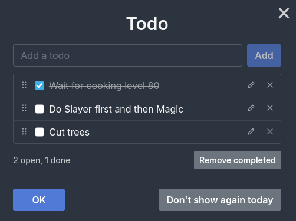

# Todo

A todo list for Melvor Idle. Every character has its own list.

- When a character has loaded, the list opens in a window if it still has unchecked todos. It waits
  until "Welcome back" and any other popups of the game have been closed. Switch this off for good
  with **Show on startup** under *Mod Settings → Todo*.
- A button in the top bar (left of the potion button) opens the same window at any time. So does the
  hotkey, **T** by default; change or disable it under *Mod Settings → Todo*.
- In the window you can add todos, check them off, edit their text (pencil), delete them (cross) and
  remove all completed ones at once.
- To change the order, drag a todo by the handle (six dots) on its left. With the keyboard: move the
  focus to the handle with Tab, then press arrow up or arrow down. Escape cancels a drag.
- **OK**, the cross in the corner, Escape and the hotkey all close the window.
- **Don't show again today** keeps the window from opening on its own until the next day. Open the
  list by hand to undo that.

## Limits

The game gives a mod 8,192 bytes of storage per character. A todo can be 200 characters long, which
leaves room for roughly 35 full-length todos or 150 short ones. The window warns when the storage is
nearly full and refuses new todos once it is full.

## Files

| File | Purpose |
| --- | --- |
| `manifest.json` | Tells the game what to load. |
| `setup.mjs` | Entry point: loads the modules and wires them together once the character is ready. |
| `src/store.mjs` | The list itself: saved format, validation, storage limit. |
| `src/modal.mjs` | The window, and when it opens on startup. |
| `src/sort.mjs` | Reordering the list by dragging or with the arrow keys. |
| `src/button.mjs` | Top bar button, with a sidebar entry as fallback. |
| `src/startup.mjs` | The "Show on startup" setting. |
| `src/hotkey.mjs` | Hotkey setting and key handling. |
| `assets/templates.html` | Markup of the window (PetiteVue template). |
| `assets/styles.css` | Styles. |
| `assets/icon.png` | Mod icon, also used for the top bar button. |

Saved data (the mod's character storage): `todos` is a list of `[done, text]` pairs with `done` as
0 or 1, in the order shown in the window, and `snoozedOn` is the day "Don't show again today" was
clicked, as `YYYY-MM-DD`.
